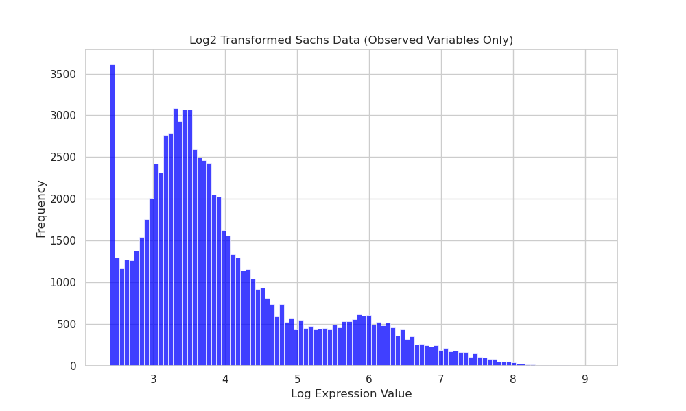
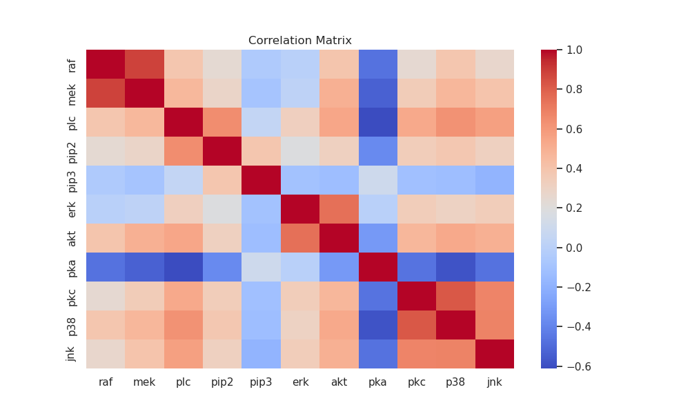
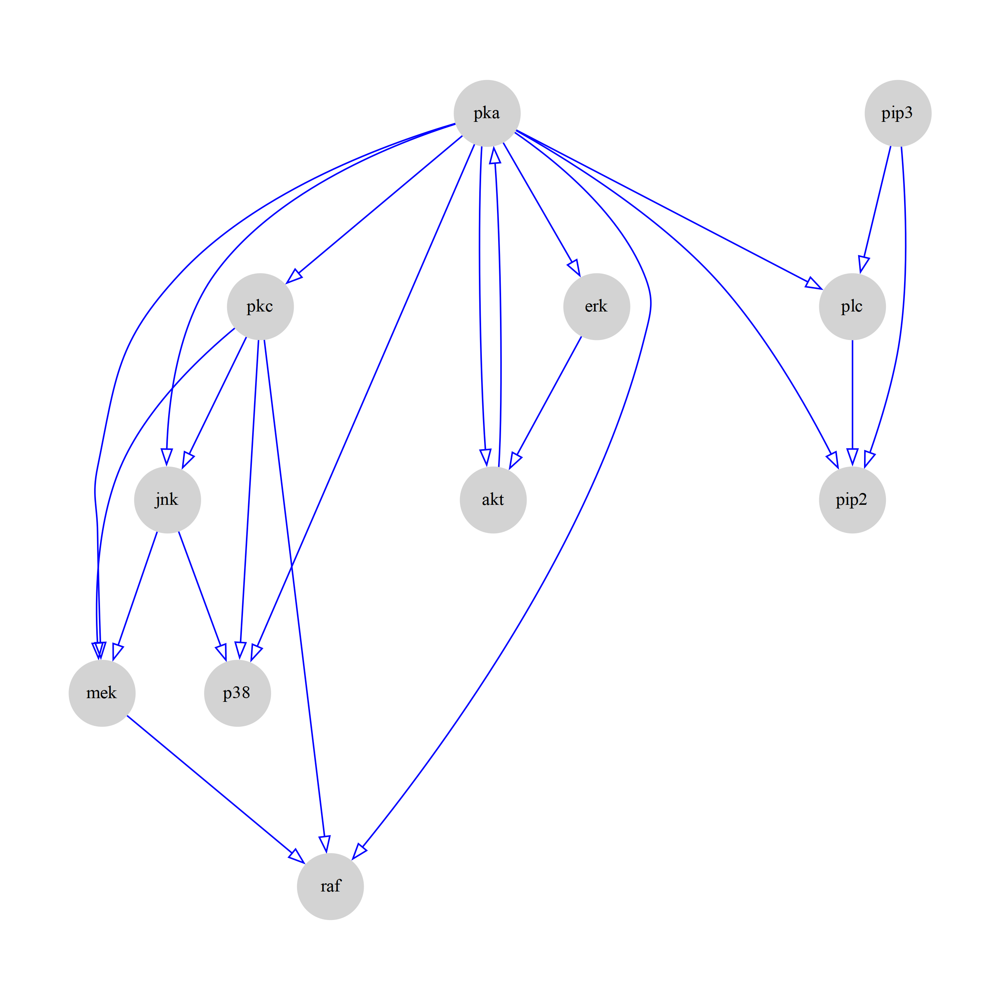
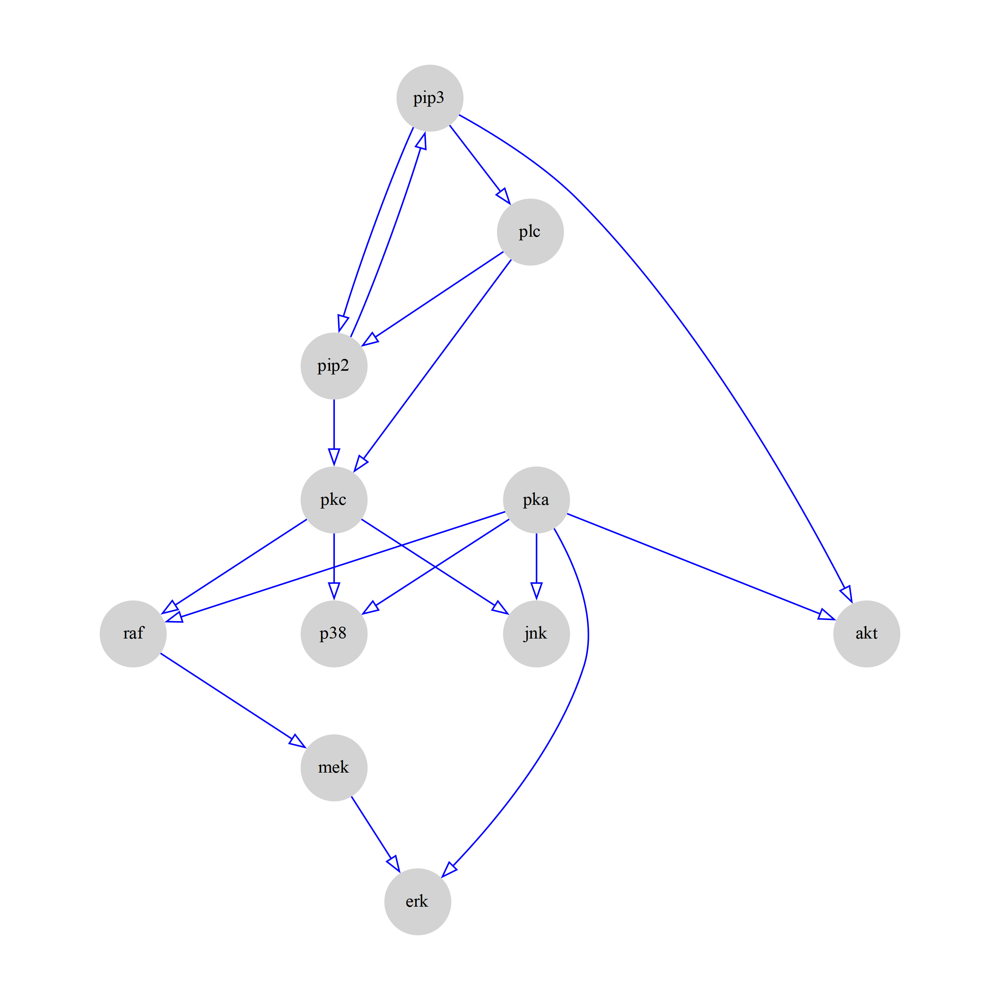

# Benchmarking Causal Discovery Algorithms on Protein Signaling Data

**Comparing FASK, FCI, GES, and LiNGAM implementations for inferring regulatory networks from perturbation experiments**

[](https://www.python.org/downloads/)
[](https://opensource.org/licenses/MIT)

---

## Overview

This project benchmarks **Fast Adjacency Skewness (FASK)**, a modern causal discovery algorithm, against established methods (FCI, GES, LiNGAM) on the Sachs et al. (2005) protein signaling dataset. Uniquely, this analysis compares **two different Python implementations** (Py-Tetrad and Causal-Learn) to evaluate both algorithmic performance and library-specific differences—going beyond the original FASK paper's scope. This project demonstrates how to rigorously validate causal discovery algorithms on ground-truth biological networks, directly applicable to analyzing modern high-content perturbation experiments like Perturb-Seq.

---

## Dataset: Sachs et al. (2005)

The Sachs dataset measures 11 phosphorylated proteins and phospholipids in primary human immune cells under both observational and interventional conditions:

- **11 proteins/phospholipids**: PKC, PKA, Raf, etc.
- **7,400+ cells** measured via flow cytometry
- **9 different conditions**: Observational + 8 targeted interventions (chemical/genetic)
- **Ground truth network**: Published regulatory relationships (Figure 2 from Sachs et al.) provide validation benchmark

**Data preprocessing** (following Ramsey & Andrews 2018):
- Log transformation of all measurements
- Intervention variables encoded with Gaussian jitter
- Background knowledge about experimental conditions incorporated where supported

This dataset is a classic test case for causal discovery because:
1. We know the true causal graph from established literature
2. It includes both observational and interventional data
3. It represents real biological complexity (e.g. non-linear relationships)

Lastly, since it is good-practice to ground oneself in some simple data exploration, here is what the processed data looks like:

<p align="center">
  
  
</p>
<p align="center"><em>Figure 1: Distribution of protein measurements (left) and correlation structure (right) in the preprocessed Sachs dataset.</em></p>

---

## Algorithms Benchmarked

### 1. **FASK (Fast Adjacency Skewness)** 
- **Type**: Hybrid constraint-based and score-based
- **Key innovation**: Uses BIC score for independence testing (FAS-stable phase), then orients edges using skewness of conditional correlations
- **Orientation strategy**: 
  - First checks for 2-cycles using correlation tests on positive subsets
  - Then uses skewness ratio to determine single-direction edges
  - Final pass checks for missed 2-cycles (threshold λ=0.3)
- **Strength**: Works well with continuous, non-Gaussian data common in biology; produces fully oriented graphs
- **Implementation**: Py-Tetrad only

### 2. **FCI (Fast Causal Inference)**
- **Type**: Constraint-based
- **Key feature**: Handles latent confounders and selection bias using conditional independence tests
- **Strength**: Conservative approach that makes minimal assumptions; can represent uncertainty with partial orientations
- **Implementations tested**: Both Py-Tetrad and Causal-Learn

### 3. **GES (Greedy Equivalence Search)**
- **Type**: Score-based (greedy search over DAG space)
- **Key feature**: Uses BIC score to search for highest-scoring causal structure
- **Strength**: Efficient for moderate-sized networks; deterministic results
- **Implementations tested**: Both Py-Tetrad and Causal-Learn

### 4. **LiNGAM (Linear Non-Gaussian Acyclic Model)**
- **Type**: ICA-based causal discovery
- **Key feature**: Assumes linear relationships with non-Gaussian noise; uses independent component analysis
- **Strength**: Can fully orient edges when linearity assumptions hold; no need for conditional independence tests
- **Implementation**: Causal-Learn only

**Note on implementations**: This analysis uniquely compares two major Python causal discovery libraries:
- **Py-Tetrad**: Python wrapper around Java Tetrad library (CMU)
- **Causal-Learn**: Pure Python implementation (Carnegie Mellon & Microsoft Research)

---

## Key Findings

### Algorithm Performance Summary

Performance is measured using **graph-structure-specific metrics** that separately evaluate:
- **Adjacency Precision (AP)**: Of predicted edges (ignoring direction), what fraction are correct?
- **Adjacency Recall (AR)**: Of true edges, what fraction were found?
- **Arrowhead Precision (AHP)**: Of predicted edge directions, what fraction are correct?
- **Arrowhead Recall (AHR)**: Of true edge directions, what fraction were recovered?

These metrics help distinguish between finding the right connections vs. orienting them correctly.

| Method | Library | AP | AR | AHP | AHR |
|--------|---------|----|----|-----|-----|
| **FASK (Ramsey 2018)** | Py-Tetrad | 0.632 | 0.750 | 0.571 | 0.706 |
| **FASK (This work)** | Py-Tetrad | **0.600** | **0.750** | **0.524** | **0.647** |
| FCI | Py-Tetrad | 0.625 | 0.313 | 0.300 | 0.176 |
| GES | Py-Tetrad | 0.533 | 0.500 | 0.267 | 0.235 |
| FCI | Causal-Learn | **0.714** | 0.313 | 0.455 | 0.294 |
| GES | Causal-Learn | 0.382 | **0.813** | 0.147 | 0.294 |
| LiNGAM | Causal-Learn | 0.333 | **1.000** | 0.208 | **0.588** |

*Bold indicates either FASK performance in this work or key performance values per method that are on par with FASK. Ramsey 2018 results shown for comparison.*

Comparing this work's output from FASK as a graphical representation against the original paper's inferred causal network, we see

<p align="center">
  
  
</p>
<p align="center"><em>Figure 2: FASK causal graph from this work (left) compared to original result from Sachs et al 2005 (right).</em></p>

### Key Insights

1. **FASK achieves best overall performance**: Near-replication of published benchmark, with balanced adjacency and arrowhead recovery. Only algorithm to maintain >0.5 performance across all four metrics.

2. **Implementation matters**: 
   - FCI results differ substantially between Py-Tetrad (AP=0.625) and Causal-Learn (AP=0.714)
   - GES shows opposite patterns: Py-Tetrad more conservative (AR=0.500), Causal-Learn more permissive (AR=0.813)
   - Suggests library choice significantly impacts research conclusions

3. **Conservative vs. permissive tradeoff**:
   - **Conservative** (FCI in Py-Tetrad): High precision, low recall—few edges but mostly correct
   - **Permissive** (LiNGAM, GES in Causal-Learn): High recall, low precision—finds all edges but many false positives
   - **Balanced** (FASK): Maintains moderate precision and high recall

4. **Arrowhead orientation is harder than adjacency**: All algorithms show 10-30% drop in arrowhead metrics vs. adjacency metrics. Determining causal direction is fundamentally more challenging than detecting relationships.

---

## Repository Structure

```
.
├── README.md                   # This file
├── data/
│   └── data.txt                # Sachs dataset (preprocessed, log-transformed)
├── src/
│   ├── pytetrad_sachs.py               # Main analysis script - will produce most figures and tables
│   ├── no_bk_pytetrad_sachs.py         # Secondary script - produces similar plots without any background info
│   ├── pytetrad_sachs_utilities.py     # Utility script used by both analysis scripts
├── results/                        # this is where your outputs will be
├── images/
│   ├── sachs_histogram.png             # log transformed data visualized
│   ├── sachs_corr.png                  # correlation plot of the sachs data
│   ├── sachs_biological.png            # causal graph from original paper
│   └── pytetrad_FASK_graph.png         # py-tetrad FASK graph produced in this work
├── requirements.txt          # Python dependencies
├── environment.yml           # Python dependencies (conda/mamba friendly)
└── LICENSE                   # MIT License
```

---

## Installation

### Prerequisites
- Python 3.9 or higher
- Linux/macOS recommended (Py-Tetrad has better support; Windows may require additional configuration)
- ~8GB RAM (most analyses run in seconds)

### Setup

1. **Clone the repository**
```bash
git clone 
cd fask-sachs-benchmark
```

2. **Install dependencies**
```bash
pip install -r requirements.txt
```

**Installation notes:**
- **Py-Tetrad** requires Java Runtime Environment (JRE) 11 or higher
  - Check: `java -version`
  - Install if needed following installation instructions (found here: https://github.com/cmu-phil/py-tetrad)

---

## Usage

### Quick Start

Run the complete benchmark:
```bash
python src/pytetrad_sachs.py
```

This will:
1. Load and preprocess the Sachs dataset
2. Run FASK algorithm (both implementations)
3. Compare against FCI, GES, and LiNGAM across both libraries
4. Calculate AP, AR, AHP, AHR for each method
5. Generate relevant plots from my original report

---

## Methodology

### Data Preprocessing

Following Ramsey & Andrews (2018):
1. Log transformation of all flow cytometry measurements
2. Standardization of protein expression values
3. Intervention variables encoded with Gaussian jitter (N(0, 0.001))
4. Background knowledge about experimental conditions provided to algorithms that support it (Py-Tetrad implementations)

**Important**: Causal-Learn implementations of GES and LiNGAM do not currently support background knowledge encoding, so intervention variables were removed for these analyses. This may explain some performance differences.

### FASK Algorithm Details

FASK operates in three phases:

**Phase 1 - Adjacency Discovery (FAS-stable)**:
Uses BIC score as conditional independence test with penalty discount *c* to find undirected skeleton graph.

**Phase 2 - Edge Orientation**:
- **2-cycle test**: Edge X—Y becomes X⇄Y if both correlation differences are significantly > 0:
  - corr(X,Y) - corr(X,Y|X>0) > threshold
  - corr(X,Y) - corr(X,Y|Y>0) > threshold
  
- **Single-direction test**: Otherwise, orient X→Y if skewness ratio > 0:
  ```
  E(XY|X>0) / sqrt(E(X²|X>0)E(Y²|X>0)) - E(XY|Y>0) / sqrt(E(X²|Y>0)E(Y²|Y>0)) > 0
  ```

**Phase 3 - 2-cycle Recovery**:
Final check for 2-cycles missed due to sign differences: |corr(X,Y|X>0) - corr(X,Y|Y>0)| > λ (λ=0.3)

Result: Fully oriented graph (no undirected edges)

### Evaluation Metrics

**Adjacency metrics** (skeleton recovery):
- **AP** = True Positive Adjacencies / All Predicted Adjacencies
- **AR** = True Positive Adjacencies / All Ground Truth Adjacencies

**Arrowhead metrics** (orientation accuracy):
- **AHP** = Correctly Oriented Edges / All Oriented Edges  
- **AHR** = Correctly Oriented Edges / All Ground Truth Directed Edges

**Why these metrics?** Graph structure evaluation requires distinguishing between:
1. Finding the right pairs of connected nodes (adjacency)
2. Getting the causal direction correct (arrowhead)

Standard precision/recall collapses these into a single metric, losing important information about what the algorithm does well vs. poorly.

### Implementation Comparison

**Py-Tetrad advantages**:
- Supports background knowledge (intervention encoding)
- Implements FASK (not available in Causal-Learn)
- More conservative parameterization by default

**Causal-Learn advantages**:
- Pure Python (no Java dependency)
- Faster for some algorithms (native implementation)
- Implements LiNGAM (not in Py-Tetrad)

This analysis used default parameters for each library to reflect "out-of-the-box" performance researchers would encounter.

---

## Reproducing Published Results

This analysis reproduces and extends Ramsey & Andrews (2018):

**Reproduced**:
- FASK adjacency performance: AP=0.600 (published: 0.632), AR=0.750 (published: 0.750)
- FASK arrowhead performance: AHP=0.524 (published: 0.571), AHR=0.647 (published: 0.706)
- Results within ~5-10% of published benchmark

**Extended beyond original paper**:
1. Comparison across two major Python implementations (Py-Tetrad, Causal-Learn)
2. Benchmarked against FCI, GES, and LiNGAM (original only compared FASK variants)
3. Quantified implementation-specific differences in algorithm performance
4. Provided all code and visualizations for reproducibility

**Differences from original**:
- Slight numerical differences likely due to random seed variations in adjacency phase
- Original used custom Java code; this uses production Python libraries
- Evaluation framework identical (same ground truth, same metrics)

---

## Relevance to Modern Perturbation Biology

### Connection to Perturb-Seq

The Sachs dataset is conceptually a **precursor to modern CRISPR perturbation screens**:

| Sachs (2005) | Perturb-Seq (2020s) |
|--------------|---------------------|
| 11 proteins | Genome-wide transcriptomes |
| 8 chemical/genetic perturbations | 100s-1000s CRISPR knockouts |
| Flow cytometry | Single-cell RNA-seq |
| Protein-protein signaling | Gene regulatory networks |
| 7,466 cells | 10,000-100,000+ cells |

**Methodological translation**:
- Targeted interventions (chemical inhibitors) → CRISPR perturbations
- Measuring downstream effects → scRNA-seq readouts  
- Inferring causal graph → Gene regulatory network reconstruction
- Known ground truth validation → Essential for algorithm development

This benchmark provides the foundation for assessing which algorithms can scale.

---

## Limitations and Future Work

### Current Limitations

1. **Small network size**: 11 nodes is tiny compared to genome-scale networks
2. **Single dataset**: Sachs is a gold standard but may not generalize to all perturbation contexts
3. **No temporal information**: Methods here assume steady-state; many biological processes are dynamic
4. **Linear assumption violations**: Some algorithms (LiNGAM) assume linearity; protein signaling often non-linear

### Future Directions

- [ ] Test on additional benchmark datasets (DREAM challenges, synthetic networks)
- [ ] Add Bayesian network scoring approaches (BGe, BDeu)
- [ ] Compare against deep learning methods (GraN-DAG, NOTEARS)
- [ ] Apply to real Perturb-Seq dataset (e.g., Adamson et al. 2016)
- [ ] Benchmark computational efficiency (runtime, memory) for scalability assessment

---

## Computational Requirements

All analyses are lightweight and can run on a modern laptop.

---

## References

### Primary Citations

1. **Sachs, K.**, Perez, O., Pe'er, D., Lauffenburger, D. A., & Nolan, G. P. (2005). Causal protein-signaling networks derived from multiparameter single-cell data. *Science*, 308(5721), 523-529.

2. **Ramsey, J. D.**, & Andrews, B. (2018). FASK: A Fast Adjacency Skewness Algorithm for Causal Discovery. *Preprint* arXiv:1805.03108.

3. **Spirtes, P.**, Glymour, C., & Scheines, R. (2000). *Causation, Prediction, and Search* (2nd ed.). MIT Press.

### Algorithm References

4. **Shimizu, S.**, Hoyer, P. O., Hyvärinen, A., & Kerminen, A. (2006). A linear non-Gaussian acyclic model for causal discovery. *Journal of Machine Learning Research*, 7(Oct), 2003-2030.

5. **Chickering, D. M.** (2002). Optimal structure identification with greedy search. *Journal of Machine Learning Research*, 3(Nov), 507-554.

6. **Zhang, J.** (2008). On the completeness of orientation rules for causal discovery in the presence of latent confounders and selection bias. *Artificial Intelligence*, 172(16-17), 1873-1896.

### Software

7. **Causal-Learn**: https://github.com/py-why/causal-learn  
   Python library implementing causal discovery algorithms.

8. **Py-Tetrad**: https://github.com/cmu-phil/py-tetrad  
   Python interface to Tetrad (Tools for Causal Inference and Causal Search).

---

## Author

**Chris Andersen**  
PhD Candidate, Computational Biology  
University of Pittsburgh  
[chrisquatjr@gmail.com](mailto:chrisquatjr@gmail.com) | [LinkedIn](https://www.linkedin.com/in/chrisquatjr/) | [GitHub](https://github.com/chrisquatjr)

*This project was completed as part of Foundations of Causation and Machine Learning (Fall 2024, Dr. Kun Zhang, CMU) and demonstrates rigorous validation of causal discovery methods on real biologically relevant perturbation data.*

---

## License

MIT License - See LICENSE file for details

---

## Acknowledgments

- **Dr. Kun Zhang** (CMU) - Course instructor and guidance on causal inference methodology
- **Causal-Learn team** - Maintainers of the Python causal discovery library
- **Py-Tetrad/Tetrad team** - Joseph Ramsey et al. for Tetrad platform and FASK implementation
- **Sachs et al.** - For creating and sharing the benchmark dataset
- **Ramsey & Andrews** - For the FASK algorithm and reproducible analysis framework

---

## Citation

If you use this benchmark or code in your research, please cite:

```bibtex
@software{Andersen2024fask,
  author = {Chris Andersen},
  title = {Benchmarking Causal Discovery Algorithms on Protein Signaling Data},
  year = {2024},
  url = {https://github.com/chrisquatjr/fask-sachs-benchmark}
}
```

And the original papers:
```bibtex
@article{sachs2005causal,
  title={Causal protein-signaling networks derived from multiparameter single-cell data},
  author={Sachs, Karen and Perez, Omar and Pe'er, Dana and Lauffenburger, Douglas A and Nolan, Garry P},
  journal={Science},
  volume={308},
  number={5721},
  pages={523--529},
  year={2005},
  publisher={American Association for the Advancement of Science}
}

@article{ramsey2018fask,
  title={FASK with interventional knowledge recovers edges from the Sachs model},
  author={Ramsey, Joseph and Andrews, Bryan},
  journal={arXiv preprint arXiv:1805.03108},
  year={2018}
}
```
